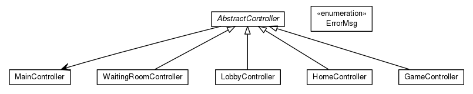

# Spécification Interne

Cette spécification interne ne présente que les noms des classes de chaque package ainsi les relations d'héritage et de compositon de chaque classe à l'intérieur du même package.

## org.copinf.cc

### org.copinf.cc.model

### org.copinf.cc.controller

### org.copinf.cc.net

#### org.copinf.cc.net.client

#### org.copinf.cc.net.server

### org.copinf.cc.view

#### org.copinf.cc.view.homepanel

#### org.copinf.cc.view.lobbypanel

#### org.copinf.cc.view.waitingroompanel

#### org.copinf.cc.view.gamepanel

Cette spécification interne a été générée automatiquement à partir des programmes [UMLGraph] et [GraphViz]. Elle peut être intégrée à la Javadoc grâce à la tâche `javadocUml` de Gradle, à condition d'avoir GraphViz installé.

[graphviz]: http://graphviz.org/
[umlgraph]: http://www.umlgraph.org/
